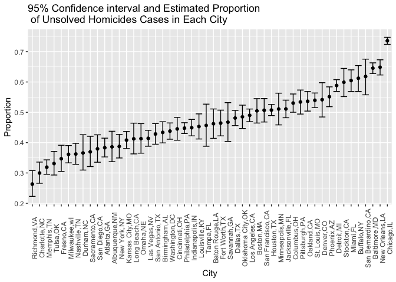
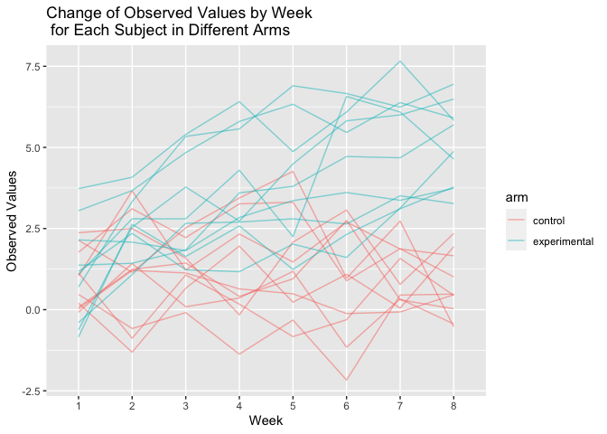

p8105\_hw5\_pz2281
================
Peilin Zhou

``` r
library(tidyverse)
```

    ## ── Attaching packages ─────────────────────────────────────── tidyverse 1.3.1 ──

    ## ✓ ggplot2 3.3.5     ✓ purrr   0.3.4
    ## ✓ tibble  3.1.4     ✓ dplyr   1.0.7
    ## ✓ tidyr   1.1.3     ✓ stringr 1.4.0
    ## ✓ readr   2.0.1     ✓ forcats 0.5.1

    ## ── Conflicts ────────────────────────────────────────── tidyverse_conflicts() ──
    ## x dplyr::filter() masks stats::filter()
    ## x dplyr::lag()    masks stats::lag()

``` r
library(ggplot2)
```

## Problem 1

Import and clean the data

``` r
homicides_data = read_csv(file = "./data/homicide-data.csv", na = c("", "Unknown"))
```

    ## Rows: 52179 Columns: 12

    ## ── Column specification ────────────────────────────────────────────────────────
    ## Delimiter: ","
    ## chr (8): uid, victim_last, victim_first, victim_race, victim_sex, city, stat...
    ## dbl (4): reported_date, victim_age, lat, lon

    ## 
    ## ℹ Use `spec()` to retrieve the full column specification for this data.
    ## ℹ Specify the column types or set `show_col_types = FALSE` to quiet this message.

``` r
head(homicides_data) 
```

    ## # A tibble: 6 × 12
    ##   uid        reported_date victim_last victim_first victim_race victim_age victim_sex
    ##   <chr>              <dbl> <chr>       <chr>        <chr>            <dbl> <chr>     
    ## 1 Alb-000001      20100504 GARCIA      JUAN         Hispanic            78 Male      
    ## 2 Alb-000002      20100216 MONTOYA     CAMERON      Hispanic            17 Male      
    ## 3 Alb-000003      20100601 SATTERFIELD VIVIANA      White               15 Female    
    ## 4 Alb-000004      20100101 MENDIOLA    CARLOS       Hispanic            32 Male      
    ## 5 Alb-000005      20100102 MULA        VIVIAN       White               72 Female    
    ## 6 Alb-000006      20100126 BOOK        GERALDINE    White               91 Female    
    ## # … with 5 more variables: city <chr>, state <chr>, lat <dbl>, lon <dbl>,
    ## #   disposition <chr>

The raw data contained homicides cases from 50 large U.S. cities.
Variables include unique case id of each city from an ascending order,
reported date of the case, victim’s name, race, age, sex, where the case
happened specified in geographical coordinates and name of hte
city/state, and case disposition. There are 52179 observations and 12
variables. Missing values exist in victim\_race, victim\_age,
victim\_race, and geographical coordindates. Missing values were changed
to N/A. We see that there is one possible data entry error which city
Tulsa should be in state Oklahoma instead of Alabama. To make
consistency for later analysis, omit this one oberservation.

add new variables to the data frame and do summarization with conditions

``` r
homicides_data = homicides_data %>% 
  mutate(
    city_state = str_c(city,state, sep = ",")
  ) %>% 
  filter(city_state != "Tulsa,AL") %>% 
  relocate(city_state)

#total number of homicides within cities
homicides_data %>% 
  group_by(city_state) %>% 
  summarise(
    n = n()
  ) %>% knitr::kable()
```

| city\_state       |    n |
|:------------------|-----:|
| Albuquerque,NM    |  378 |
| Atlanta,GA        |  973 |
| Baltimore,MD      | 2827 |
| Baton Rouge,LA    |  424 |
| Birmingham,AL     |  800 |
| Boston,MA         |  614 |
| Buffalo,NY        |  521 |
| Charlotte,NC      |  687 |
| Chicago,IL        | 5535 |
| Cincinnati,OH     |  694 |
| Columbus,OH       | 1084 |
| Dallas,TX         | 1567 |
| Denver,CO         |  312 |
| Detroit,MI        | 2519 |
| Durham,NC         |  276 |
| Fort Worth,TX     |  549 |
| Fresno,CA         |  487 |
| Houston,TX        | 2942 |
| Indianapolis,IN   | 1322 |
| Jacksonville,FL   | 1168 |
| Kansas City,MO    | 1190 |
| Las Vegas,NV      | 1381 |
| Long Beach,CA     |  378 |
| Los Angeles,CA    | 2257 |
| Louisville,KY     |  576 |
| Memphis,TN        | 1514 |
| Miami,FL          |  744 |
| Milwaukee,wI      | 1115 |
| Minneapolis,MN    |  366 |
| Nashville,TN      |  767 |
| New Orleans,LA    | 1434 |
| New York,NY       |  627 |
| Oakland,CA        |  947 |
| Oklahoma City,OK  |  672 |
| Omaha,NE          |  409 |
| Philadelphia,PA   | 3037 |
| Phoenix,AZ        |  914 |
| Pittsburgh,PA     |  631 |
| Richmond,VA       |  429 |
| Sacramento,CA     |  376 |
| San Antonio,TX    |  833 |
| San Bernardino,CA |  275 |
| San Diego,CA      |  461 |
| San Francisco,CA  |  663 |
| Savannah,GA       |  246 |
| St. Louis,MO      | 1677 |
| Stockton,CA       |  444 |
| Tampa,FL          |  208 |
| Tulsa,OK          |  583 |
| Washington,DC     | 1345 |

Total number of homicide cases within each city as a table.

``` r
#total number of unsolved homicides
homicides_data  = homicides_data %>% 
  mutate(status = ifelse(disposition == "Closed by arrest", "solved", "unsolved")) 

unsolved_table = homicides_data %>% 
  filter(status == "unsolved") %>% 
  group_by(city_state) %>% 
  summarise(unsolved_case = n()) %>% 
  knitr::kable()
unsolved_table
```

| city\_state       | unsolved\_case |
|:------------------|---------------:|
| Albuquerque,NM    |            146 |
| Atlanta,GA        |            373 |
| Baltimore,MD      |           1825 |
| Baton Rouge,LA    |            196 |
| Birmingham,AL     |            347 |
| Boston,MA         |            310 |
| Buffalo,NY        |            319 |
| Charlotte,NC      |            206 |
| Chicago,IL        |           4073 |
| Cincinnati,OH     |            309 |
| Columbus,OH       |            575 |
| Dallas,TX         |            754 |
| Denver,CO         |            169 |
| Detroit,MI        |           1482 |
| Durham,NC         |            101 |
| Fort Worth,TX     |            255 |
| Fresno,CA         |            169 |
| Houston,TX        |           1493 |
| Indianapolis,IN   |            594 |
| Jacksonville,FL   |            597 |
| Kansas City,MO    |            486 |
| Las Vegas,NV      |            572 |
| Long Beach,CA     |            156 |
| Los Angeles,CA    |           1106 |
| Louisville,KY     |            261 |
| Memphis,TN        |            483 |
| Miami,FL          |            450 |
| Milwaukee,wI      |            403 |
| Minneapolis,MN    |            187 |
| Nashville,TN      |            278 |
| New Orleans,LA    |            930 |
| New York,NY       |            243 |
| Oakland,CA        |            508 |
| Oklahoma City,OK  |            326 |
| Omaha,NE          |            169 |
| Philadelphia,PA   |           1360 |
| Phoenix,AZ        |            504 |
| Pittsburgh,PA     |            337 |
| Richmond,VA       |            113 |
| Sacramento,CA     |            139 |
| San Antonio,TX    |            357 |
| San Bernardino,CA |            170 |
| San Diego,CA      |            175 |
| San Francisco,CA  |            336 |
| Savannah,GA       |            115 |
| St. Louis,MO      |            905 |
| Stockton,CA       |            266 |
| Tampa,FL          |             95 |
| Tulsa,OK          |            193 |
| Washington,DC     |            589 |

Total number of unsolved homicide cases within each city as a table.

Conduct prop.test for Baltimore,MD

``` r
bal_unsolved_data = homicides_data %>% 
  filter(city_state == "Baltimore,MD") %>% 
  summarise(
    unsolved = sum(status == "unsolved"),
    num_case = n()
  ) 

bal_test_result = 
  prop.test(x = bal_unsolved_data %>% pull(unsolved), n = bal_unsolved_data %>% pull(num_case)) %>% 
  broom::tidy() %>% 
  select(estimate, conf.low, conf.high)
bal_test_result
```

    ## # A tibble: 1 × 3
    ##   estimate conf.low conf.high
    ##      <dbl>    <dbl>     <dbl>
    ## 1    0.646    0.628     0.663

The estimated proportion of unsolved homicides in Baltimore is
0.6455607. The 95% confidence interval is 0.6275625 to 0.6631599.

prop.test for every city:

First, write a function to make the above steps generalized to every
dataframe with same variable/format

``` r
city_test = function(df) {
  df_test = df %>% 
    summarise(
    unsolved = sum(status == "unsolved"),
    num_case = n()
  ) 

city_test_result = prop.test(x = df_test %>% pull(unsolved), n = df_test %>% pull(num_case)) %>% 
  broom::tidy() %>% 
  select(estimate, conf.low, conf.high)

return(city_test_result)
}
```

Calling the function by mapping for the nested df and unnest it for
better illustration of the results.

``` r
homicides_nest_result = 
  homicides_data %>% 
  nest(data = uid:status) %>% 
  mutate(test_result = map(data, city_test)) %>% 
  unnest(test_result) %>% 
  select(-data)

homicides_nest_result %>% 
  knitr::kable()
```

| city\_state       |  estimate |  conf.low | conf.high |
|:------------------|----------:|----------:|----------:|
| Albuquerque,NM    | 0.3862434 | 0.3372604 | 0.4375766 |
| Atlanta,GA        | 0.3833505 | 0.3528119 | 0.4148219 |
| Baltimore,MD      | 0.6455607 | 0.6275625 | 0.6631599 |
| Baton Rouge,LA    | 0.4622642 | 0.4141987 | 0.5110240 |
| Birmingham,AL     | 0.4337500 | 0.3991889 | 0.4689557 |
| Boston,MA         | 0.5048860 | 0.4646219 | 0.5450881 |
| Buffalo,NY        | 0.6122841 | 0.5687990 | 0.6540879 |
| Charlotte,NC      | 0.2998544 | 0.2660820 | 0.3358999 |
| Chicago,IL        | 0.7358627 | 0.7239959 | 0.7473998 |
| Cincinnati,OH     | 0.4452450 | 0.4079606 | 0.4831439 |
| Columbus,OH       | 0.5304428 | 0.5002167 | 0.5604506 |
| Dallas,TX         | 0.4811742 | 0.4561942 | 0.5062475 |
| Denver,CO         | 0.5416667 | 0.4846098 | 0.5976807 |
| Detroit,MI        | 0.5883287 | 0.5687903 | 0.6075953 |
| Durham,NC         | 0.3659420 | 0.3095874 | 0.4260936 |
| Fort Worth,TX     | 0.4644809 | 0.4222542 | 0.5072119 |
| Fresno,CA         | 0.3470226 | 0.3051013 | 0.3913963 |
| Houston,TX        | 0.5074779 | 0.4892447 | 0.5256914 |
| Indianapolis,IN   | 0.4493192 | 0.4223156 | 0.4766207 |
| Jacksonville,FL   | 0.5111301 | 0.4820460 | 0.5401402 |
| Kansas City,MO    | 0.4084034 | 0.3803996 | 0.4370054 |
| Las Vegas,NV      | 0.4141926 | 0.3881284 | 0.4407395 |
| Long Beach,CA     | 0.4126984 | 0.3629026 | 0.4642973 |
| Los Angeles,CA    | 0.4900310 | 0.4692208 | 0.5108754 |
| Louisville,KY     | 0.4531250 | 0.4120609 | 0.4948235 |
| Memphis,TN        | 0.3190225 | 0.2957047 | 0.3432691 |
| Miami,FL          | 0.6048387 | 0.5685783 | 0.6400015 |
| Milwaukee,wI      | 0.3614350 | 0.3333172 | 0.3905194 |
| Minneapolis,MN    | 0.5109290 | 0.4585150 | 0.5631099 |
| Nashville,TN      | 0.3624511 | 0.3285592 | 0.3977401 |
| New Orleans,LA    | 0.6485356 | 0.6231048 | 0.6731615 |
| New York,NY       | 0.3875598 | 0.3494421 | 0.4270755 |
| Oakland,CA        | 0.5364308 | 0.5040588 | 0.5685037 |
| Oklahoma City,OK  | 0.4851190 | 0.4467861 | 0.5236245 |
| Omaha,NE          | 0.4132029 | 0.3653146 | 0.4627477 |
| Philadelphia,PA   | 0.4478103 | 0.4300380 | 0.4657157 |
| Phoenix,AZ        | 0.5514223 | 0.5184825 | 0.5839244 |
| Pittsburgh,PA     | 0.5340729 | 0.4942706 | 0.5734545 |
| Richmond,VA       | 0.2634033 | 0.2228571 | 0.3082658 |
| San Antonio,TX    | 0.4285714 | 0.3947772 | 0.4630331 |
| Sacramento,CA     | 0.3696809 | 0.3211559 | 0.4209131 |
| Savannah,GA       | 0.4674797 | 0.4041252 | 0.5318665 |
| San Bernardino,CA | 0.6181818 | 0.5576628 | 0.6753422 |
| San Diego,CA      | 0.3796095 | 0.3354259 | 0.4258315 |
| San Francisco,CA  | 0.5067873 | 0.4680516 | 0.5454433 |
| St. Louis,MO      | 0.5396541 | 0.5154369 | 0.5636879 |
| Stockton,CA       | 0.5990991 | 0.5517145 | 0.6447418 |
| Tampa,FL          | 0.4567308 | 0.3881009 | 0.5269851 |
| Tulsa,OK          | 0.3310463 | 0.2932349 | 0.3711192 |
| Washington,DC     | 0.4379182 | 0.4112495 | 0.4649455 |

Plot the confidence interval and estimated proportion:

``` r
homicides_nest_result %>% 
  mutate(city_state = forcats::fct_reorder(city_state, estimate)) %>%
  ggplot() +
  geom_errorbar(mapping = aes(x = city_state, ymin = conf.low, ymax = conf.high)) +
  geom_point(mapping = aes(x = city_state, y = estimate)) +
  theme(axis.text.x = element_text(angle = 90)) +
  labs(
    title = "95% Confidence interval and Estimated Proportion \n of Unsolved Homicides Cases in Each City",
    x = "City",
    y = "Proportion"
       )
```

<!-- -->

## Problem 2

``` r
path = "./data/data2"
data_names = list.files(path, pattern = ".csv")
```

``` r
study_df = tibble(
  id = data_names
) %>% 
  mutate(vars = map(id, ~ read_csv(file.path(path, .)))) %>% 
  unnest(vars) %>% 
  pivot_longer(
    cols = !id,
    names_to = "week",
    names_prefix = "week_",
    values_to = "observed_value"
    ) %>% 
  mutate(id = gsub(".csv", "", id)) %>% 
  mutate(arm_id = id) %>% 
  separate(id, c("arm", "id"), sep = "_") %>% 
  mutate(arm = recode(arm, con = "control", exp = "experimental"))
study_df
```

    ## # A tibble: 160 × 5
    ##    arm     id    week  observed_value arm_id
    ##    <chr>   <chr> <chr>          <dbl> <chr> 
    ##  1 control 01    1               0.2  con_01
    ##  2 control 01    2              -1.31 con_01
    ##  3 control 01    3               0.66 con_01
    ##  4 control 01    4               1.96 con_01
    ##  5 control 01    5               0.23 con_01
    ##  6 control 01    6               1.09 con_01
    ##  7 control 01    7               0.05 con_01
    ##  8 control 01    8               1.94 con_01
    ##  9 control 02    1               1.13 con_02
    ## 10 control 02    2              -0.88 con_02
    ## # … with 150 more rows

dataframe was cleaned.

``` r
spaghetti_plot = study_df %>% 
  ggplot(aes(x = week, y = observed_value, group = arm_id, color = arm)) +
  geom_line(alpha = 0.5) +
  labs(
    title = "Change of Observed Values by Week \n for Each Subject in Different Arms",
    x = "Week",
    y = "Observed Values"
  )
spaghetti_plot
```

<!-- -->

From the plot, we can see that from week 1 to week 8, there was an
noticeable trend of general increase of the observed value in the
experimental group. The change of the value is from around 0-3.75 to
3.75-7. However, there is no significant trend of increase or decrease
for the observed value in the control group as weeks passed. Observed
values maintained around 0 to 2.5 from week 1 to week 8.

## Problem 3

``` r
set.seed(10)

iris_with_missing = iris %>% 
  map_df(~replace(.x, sample(1:150, 20), NA)) %>%
  mutate(Species = as.character(Species))
```

Write function:

``` r
missing_values_handle = function(x) {
   if (!is.numeric(x)) {
    x = ifelse(is.na(x), "virginica", x)
  } else {
    x = ifelse(is.na(x), mean(x, na.rm = TRUE), x)
  }
  return(x)
}
```

passing it to the data by mapping

``` r
iris_list_missing  = as.list(iris_with_missing)
iris_no_NA =  map(.x = iris_list_missing, ~ missing_values_handle(.x)) %>% 
 bind_rows()
iris_no_NA
```

    ## # A tibble: 150 × 5
    ##    Sepal.Length Sepal.Width Petal.Length Petal.Width Species
    ##           <dbl>       <dbl>        <dbl>       <dbl> <chr>  
    ##  1         5.1          3.5         1.4         0.2  setosa 
    ##  2         4.9          3           1.4         0.2  setosa 
    ##  3         4.7          3.2         1.3         0.2  setosa 
    ##  4         4.6          3.1         1.5         1.19 setosa 
    ##  5         5            3.6         1.4         0.2  setosa 
    ##  6         5.4          3.9         1.7         0.4  setosa 
    ##  7         5.82         3.4         1.4         0.3  setosa 
    ##  8         5            3.4         1.5         0.2  setosa 
    ##  9         4.4          2.9         1.4         0.2  setosa 
    ## 10         4.9          3.1         3.77        0.1  setosa 
    ## # … with 140 more rows

``` r
#show there is no missing values
iris_no_NA %>%
  summarise_all(~ sum(is.na(.)))
```

    ## # A tibble: 1 × 5
    ##   Sepal.Length Sepal.Width Petal.Length Petal.Width Species
    ##          <int>       <int>        <int>       <int>   <int>
    ## 1            0           0            0           0       0

Numerical missing values are replaced with mean of non-missing values
for each variable. Missing values in character variables are replaced
with ‘verginica’.
